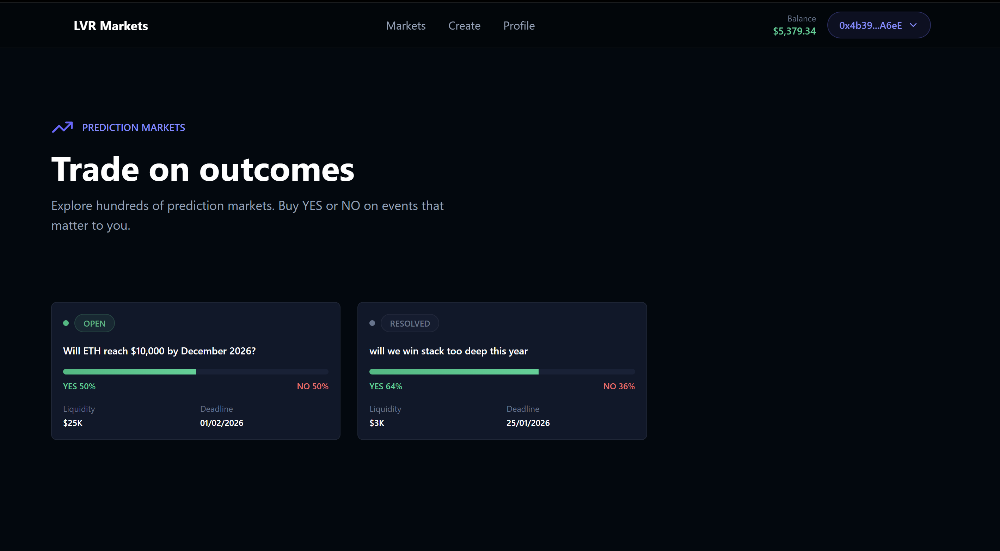
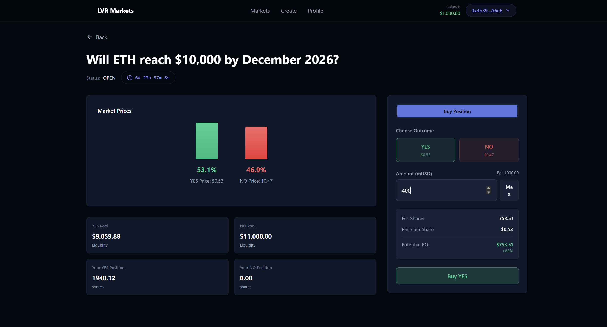
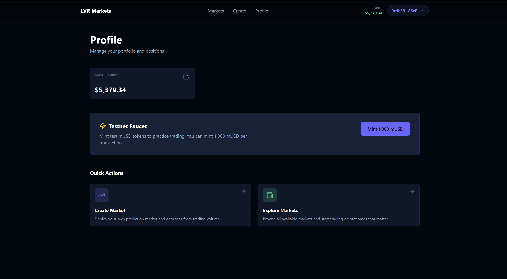
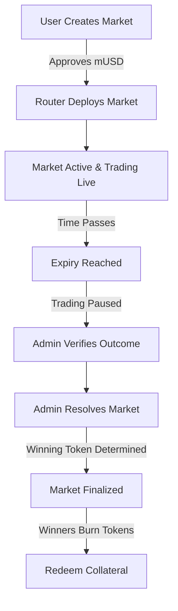

<div align="center">


# 🔮 LvrAMM
### Next-Gen Prediction Market AMM with LVR Protection

[](https://soliditylang.org)
[](https://react.dev)
[](https://book.getfoundry.sh)
[](https://wagmi.sh)
[](LICENSE)

**[🚀 Quick Start](#installation) • [📖 Features](#-features) • [🧠 Architecture](#-architecture) • [🧪 Contracts](#-smart-contracts)**

Built with ❤️ by **Team CipherText**
</div>

---

## 🎯 What is LvrAMM?
LvrAMM is a decentralized prediction market platform powered by a specialized Automated Market Maker (AMM) designed to minimize Loss-Versus-Rebalancing (LVR) based on the Research Paper by Paradigm. Unlike traditional prediction markets that suffer from liquidity fragmentation and high slippage, LvrAMM utilizes a robust router architecture to ensure efficient trading, dynamic market creation, and verifiable on-chain resolution.

### The Problem
- **Liquidity Fragmentation**: Each outcome token reduces pool efficiency.
- **High Slippage**: Traders face poor execution on binary outcomes.
- **Oracle Latency**: Slow resolutions lock up capital unnecessarily.

### The Solution
- **Unified Router Architecture**: Centralized entry point for uniform liquidity management.
- **Optimized AMM Curves**: Tailored specifically for binary (YES/NO) asset pricing.
- **Trustless Resolution**: Admin-verified outcomes with transparent on-chain redemption.

---

## 🖼️ Interface
<div align="center">

| | |
|:-------------------------:|:-------------------------:|
|  <br> **Live Markets** |  <br> **Trading Interface** |
|  <br> **Market Creation** |  <br> **User Dashboard** |

</div>

---

## ✨ Features

### 💎 Smart Contracts
- **Router Pattern**: A single `Router.sol` manages deployment and interaction for all markets, standardizing security and upgrades.
- **Precision Accounting**: Full 18-decimal precision support for shares and collateral, ensuring zero dust loss during redemption.
- **Dynamic Expiry**: Markets support flexible durations (Days, Hours, Minutes) with automated state transitions.
- **Solvency Checks**: Strict `balanceOf` and allowance verifications prevent failed transactions before execution.

### 💻 Frontend
- **Zero-Config Onboarding**: Auto-connects to Sepolia and detects network mismatches.
- **Real-Time Data**: Live countdown timers, price updates, and portfolio tracking.
- **Testnet Faucet**: Integrated MockUSD minting for instant user testing.
- **Robust Error Handling**: Clear feedback for allowances, gas estimation, and transaction status.

---

## 🏗️ Tech Stack

| Component | Technology |
|:---|:---|
| **Contracts** | Solidity 0.8.19, Foundry (Forge/Cast) |
| **Frontend** | React 18, Vite, TailwindCSS |
| **Data & Auth** | Wagmi v2, Viem, TanStack Query |
| **Network** | Ethereum Sepolia (Testnet) |
| **RPC Provider** | Alchemy |

---

## 📚 Architecture

### Interaction Flow
LvrAMM uses a hub-and-spoke model where the **Router** acts as the central gateway.



---

## 📦 Installation

### Prerequisites
- Node.js v18+
- Foundry

### 1. Clone Repository
```bash
git clone https://github.com/teamciphertext/lvramm.git
cd lvramm
```

### 2. Smart Contracts
```bash
cd contract
forge install
forge build
```

**Deployment (Sepolia):**
```bash
# Create .env with PRIVATE_KEY
source .env
forge script script/Deploy.s.sol:Deploy --rpc-url $SEPOLIA_RPC --broadcast
```

### 3. Frontend
```bash
cd frontend
npm install
npm run dev
```
Open `http://localhost:5173` to view the dApp.

---

## 🧪 Testing

We use Foundry for invariant and unit testing.

```bash
cd contract
# Run all tests
forge test

# Run with gas report
forge test --gas-report

# Verbose trace for debugging
forge test -vvvv
```

---

## 🛣️ Roadmap

- [x] **Core AMM**: Buy/Sell YES/NO tokens
- [x] **Market Factory**: Permissionless creation
- [x] **Redemption**: 1:1 collateral readout for winners
- [ ] **LVR Minimization**: Dynamic fee adjustment based on volatility
- [ ] **Data Graph**: Indexing via The Graph for historical data
- [ ] **Mainnet Launch**: Deployment on Arbitrum/Base

---

## 🤝 Contributing

1. Fork the Project
2. Create your Feature Branch (`git checkout -b feature/AmazingFeature`)
3. Commit your Changes (`git commit -m 'Add some AmazingFeature'`)
4. Push to the Branch (`git push origin feature/AmazingFeature`)
5. Open a Pull Request

---

## 📄 License

Distributed under the MIT License. See `LICENSE` for more information.

---

